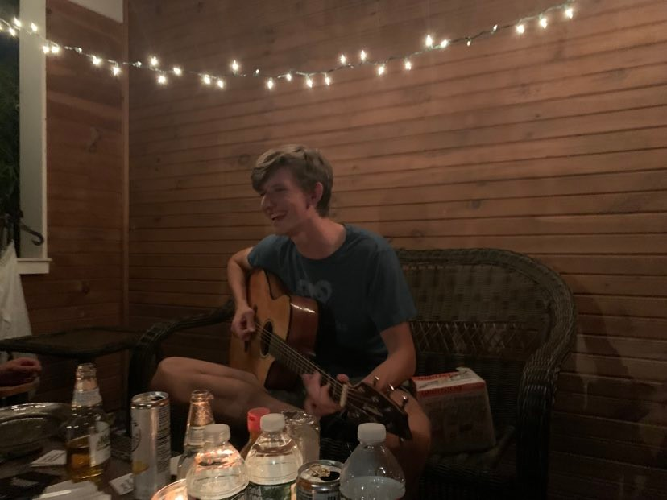

<!-- PROJECT LOGO -->
 

  

<h3 align="center">Hubert Boguski</h3>

👋 Hi, I go by Hubert, Hub, hey man... It's all the same to me 😂
- 👀 I’m interested in anything thats done for fun 
- 🌱 I’m currently learning 🎸, 🎹, and codin for fun
- 💞️ If you're building something for fun, reach out to me!
- 📫 <a href="https://www.linkedin.com/in/hubertboguski/">LinkedIn</a>

<!---
hubert-boguski/hubert-boguski is a ✨ special ✨ repository because its `README.md` (this file) appears on your GitHub profile.
You can click the Preview link to take a look at your changes.
--->
